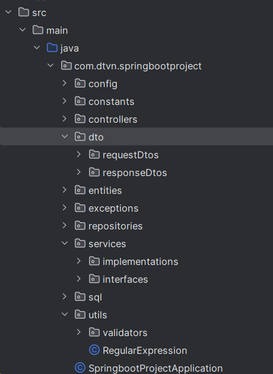
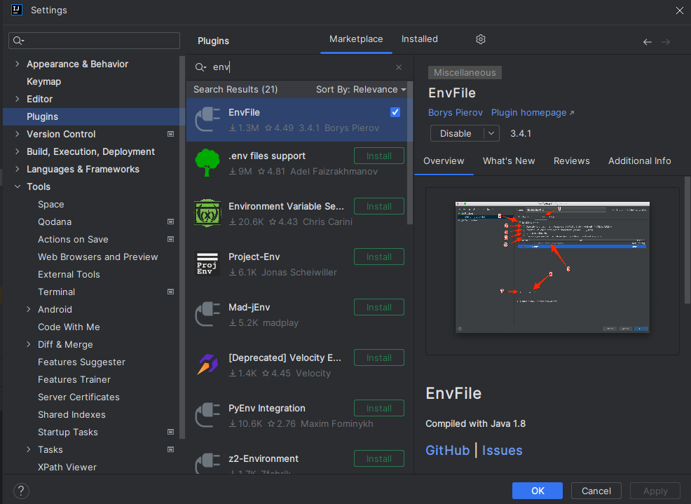
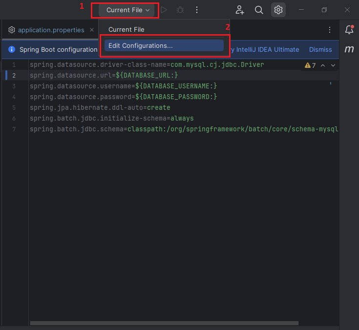
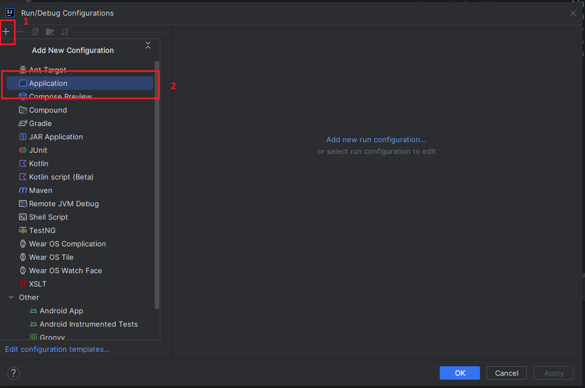
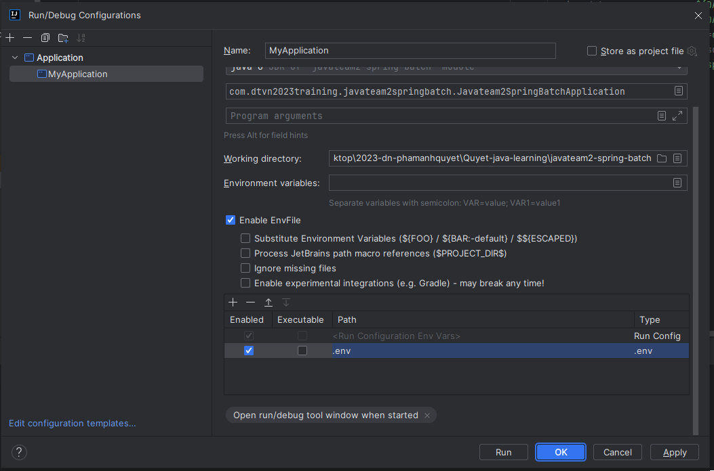

## Project folder structure


## Note:
- The server runs on port 8080 with domain: http://localhost:8080
- Before you run this project, you must go to .\src\main\java\com\dtvn\springbootproject\sql, open CreateTable.sql, execute all sql in order from top to bottom

## Mock account:

ENDPOINT: POST /api/v1/auth/login
```json
{
  "email": "quyet@mail.com",
  "password": "Quyetka@123"
}
```

## Running the Project
To run the project:

Before you run this project, let's config environment for this project.
1. Install plugin 'EnvFile'
   
2. Add configuration
   
   
3. Setting for configuration we've just created
   
4. Go to .env.example file, rename it to .env and pass appropriate values to all variable in that file.
